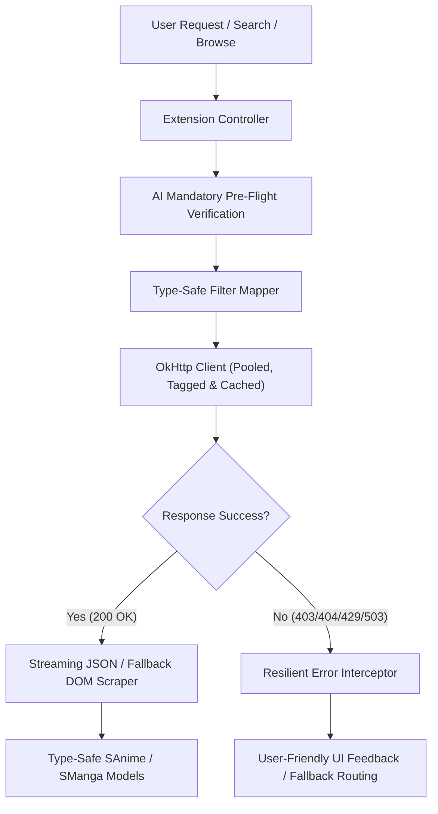

# Extension Upgrade Blueprint 🚀

This document outlines the architectural patterns, verification workflows, and exception diagnostic systems to upgrade your extensions (Anime, Manga, and Novels) to be highly efficient, resilient, and developer-friendly.

---

## 🏗️ Architectural Overview



---

## 🤖 1. Mandatory AI Pre-Flight Verification Workflow

> [!IMPORTANT]
> AI agents and automated verification scripts **MUST** run this diagnostic checklist for every extension during domain checks, API checks, and build validations:

```
┌─────────────────────────────────────────────────────────────────────────┐
│                      AUTOMATED AI VERIFICATION SUITE                    │
├──────────────────────────────┬──────────────────────────────────────────┤
│ Step 1: Domain Liveness      │ Test baseUrl & API domains for active TLD│
│ Step 2: Endpoint Liveness    │ Check admin-ajax / REST APIs for 404/400 │
│ Step 3: Embed Host Mapping   │ Route proxy domains (playmogo -> Dood)   │
│ Step 4: Parameter Loss Check │ Use OkHttp Request Tagging on redirects  │
│ Step 5: Index Sync Check     │ Ensure output APK name matches index.json│
│ Step 6: Override Check       │ Strip 'override' on fork-specific methods│
└──────────────────────────────┴──────────────────────────────────────────┘
```

### Verification Checklist Commands & Rules
1. **Domain Liveness Verification**: Run automated HTTP status scripts to verify DNS resolution and SSL status for `baseUrl` and API domains. Update TLDs immediately if domains migrate (e.g., `.su` → `.cc`).
2. **API & AJAX Endpoint Verification**: Probe `/wp-admin/admin-ajax.php` endpoints. If the server returns `404 Not Found` or `400 Bad Request`, check if the website uses a `no_ajax` HTML player container (`div#source-player-$nume iframe`) and fall back to DOM scraping.
3. **Embed Host Alias Resolution**: Verify video embeds against known host domains. Map third-party proxy domains (e.g. `playmogo.com`, `ds2play.com`) directly to standard extractors (`DoodExtractor`, `MixDropExtractor`).
4. **Redirect Parameter Loss Verification**: Test whether multi-hop embeds (e.g. `vidsrc.me`) strip URL query parameters during redirect hops. Use OkHttp request tagging (`VideoTag`) to pass metadata directly across network boundaries.
5. **Distribution Index Sync Verification**: Confirm that compiled output APK names match the `apk` key in `index.min.json`. Strip `-debug.apk` suffixes during distribution copy tasks to prevent 404 download errors in client apps.
6. **Namespace & Override Compatibility**: Ensure non-standard fork methods (e.g., `relatedAnimeListRequest`) do not use the `override` keyword when compiling inside the standard Aniyomi tree.

---

## ⚡ 2. High-Efficiency Design

To minimize CPU overhead, battery drainage, and memory footprints:

### A. Prefer Streaming JSON over HTML DOM Parsing
Many sources have hidden or undocumented REST APIs. Scraping HTML pages using JSoup is CPU-heavy and easily broken by website redesigns.
*   **Best Practice:** Always inspect network traffic to see if a mobile API or JSON endpoint is available.
*   **Technique:** Use `kotlinx.serialization` to deserialize only required fields into data classes.
    ```kotlin
    @Serializable
    private data class SearchResultDto(
        val items: List<AnimeItem>
    ) {
        @Serializable
        data class AnimeItem(val id: String, val title: String, val cover: String)
    }
    ```

### B. Reuse OkHttp Clients & Enable Request Tagging
Do not rebuild OkHttp clients per request. Use `.newBuilder()` to inherit connection pools.
*   **Request Tagging for Redirect Preservation**: Attach custom data objects to requests using OkHttp `.tag()` to preserve metadata across redirects:
    ```kotlin
    private data class VideoTag(val tmdbId: String, val season: String, val episode: String)

    val tag = VideoTag(tmdbId, season, epNum)
    val request = GET(url, headers).newBuilder().tag(VideoTag::class.java, tag).build()
    ```

### C. Compile Regexes Lazily
Compiling `Regex` patterns inside looping functions is expensive.
*   **Best Practice:** Declare all Regexes inside the `companion object` or instantiate them lazily so they are compiled only once.
    ```kotlin
    companion object {
        private val ID_REGEX by lazy { Regex("""/drama/(\d+)""") }
    }
    ```

---

## 🛡️ 3. Comprehensive Exception Diagnostic Matrix

Extensions must fail gracefully and provide precise feedback for runtime errors:

| Exception / Error Code | Root Cause | Diagnosis & Solution |
| :--- | :--- | :--- |
| **`403 Forbidden`** | Geo-blocking / WAF / Cloudflare | Intercept code and prompt user: `"Geo-blocked (403): Please connect to a [Region] VPN or solve Cloudflare in WebView."` |
| **`404 Not Found`** | Dead domain OR Repository Index filename mismatch | Verify domain liveness. If occurring during APK download, ensure output APK name in `apks/anime/apk/` matches `index.min.json` (strip `-debug`). |
| **`400 Bad Request`** | Disabled AJAX endpoint or missing headers | Admin AJAX endpoint blocked by `no_ajax` theme. Fall back to scraping `div#source-player-$nume iframe` directly from page HTML. |
| **`429 Too Many Requests`** | Rate limiting threshold hit | Attach `RateLimitInterceptor(2, 1, TimeUnit.SECONDS)` to client. |
| **`503 Service Unavailable`** | DDoS protection / Cloudflare challenge | Throw `"Cloudflare / DDoS protection active. Please solve challenge in WebView."` |
| **`InstantiationError: Stub!`** | Host app loaded stub library JARs | Dynamic DEX loader invoked stub base class constructor. Replace stub JARs in host app with non-stub implementations. |
| **`LinkageError: PreferenceScreen`** | Missing Preference library in DexClassLoader | `DexClassLoader` missing `androidx.preference.PreferenceScreen`. Wrap preference setup in safe reflection or bundle host preference classes. |
| **`JsonLiteral is not a JsonArray`** | Unresolved JS Promise in QuickJS (Novels) | QuickJS engine microtask queue not executed. Inject synchronous `SyncedPromise` polyfill in JavaScript runtime loader. |
| **`Compilation error: overrides nothing`** | Fork-specific method compiled in Aniyomi tree | `relatedAnimeListRequest` not in Aniyomi base class. Remove `override` keyword; method compiles cleanly and runs via reflection in Tadami. |

---

## 🔍 4. Type-Safe Filtering System

Define filters using a clean, extensible class structure that translates directly into query parameters.
```kotlin
open class UriPartFilter(
    displayName: String,
    val vals: Array<String>,
    val keys: Array<String>
) : Filter.Select<String>(displayName, vals) {
    fun toQuery(): String = keys[state]
}
```

---

## 📝 5. Reference Extension Blueprint

Here is a blueprint skeleton for a modern, highly robust extension incorporating OkHttp request tagging, `no_ajax` HTML fallback, and resilient error handling:

```kotlin
package eu.kanade.tachiyomi.animeextension.all.sample

import eu.kanade.tachiyomi.animesource.model.AnimeFilterList
import eu.kanade.tachiyomi.animesource.model.AnimesPage
import eu.kanade.tachiyomi.animesource.model.SAnime
import eu.kanade.tachiyomi.animesource.model.SEpisode
import eu.kanade.tachiyomi.animesource.model.Video
import eu.kanade.tachiyomi.animesource.online.ParsedAnimeHttpSource
import eu.kanade.tachiyomi.lib.doodextractor.DoodExtractor
import eu.kanade.tachiyomi.network.GET
import eu.kanade.tachiyomi.network.POST
import okhttp3.FormBody
import okhttp3.OkHttpClient
import okhttp3.Request
import okhttp3.Response
import org.jsoup.nodes.Document
import org.jsoup.nodes.Element

class SafeSampleExtension : ParsedAnimeHttpSource() {
    override val name = "Safe Source"
    override val baseUrl = "https://hexawatch.cc"
    override val lang = "en"
    override val supportsLatest = true

    private val doodExtractor by lazy { DoodExtractor(client) }

    // Private request tag to preserve metadata across redirects
    private data class VideoTag(
        val tmdbId: String,
        val season: String,
        val episode: String
    )

    // Reuse client connection pool with error interception
    override val client: OkHttpClient = network.client.newBuilder()
        .addInterceptor { chain ->
            val response = chain.proceed(chain.request())
            if (!response.isSuccessful) {
                val errorMsg = when (response.code) {
                    403 -> "Geo-blocked (403): Access denied by server."
                    404 -> "Not Found (404): Page or stream endpoint missing."
                    400 -> "Bad Request (400): Invalid request parameters."
                    429 -> "Rate Limited (429): Please slow down."
                    503 -> "DDoS Shield (503): Cloudflare block detected."
                    else -> "HTTP Error ${response.code}"
                }
                throw Exception(errorMsg)
            }
            response
        }
        .build()

    // 1. Tagged Request Building (Preserves metadata across multi-hop redirects)
    override fun videoListRequest(episode: SEpisode): Request {
        val tmdbId = episode.url.substringAfter("/movie/")
        val tag = VideoTag(tmdbId, "1", "1")
        val videoHeaders = headersBuilder().set("Referer", "$baseUrl/").build()
        
        return GET("$baseUrl/embed/movie?tmdb=$tmdbId", videoHeaders)
            .newBuilder()
            .tag(VideoTag::class.java, tag)
            .build()
    }

    // 2. Video Parsing with Tag Recovery & Fallbacks
    override fun videoListParse(response: Response): List<Video> {
        val tag = response.request.tag(VideoTag::class.java)
        val tmdbId = tag?.tmdbId ?: ""
        
        val doc = response.asJsoup()
        val videoList = mutableListOf<Video>()

        // Check DOM iframe first (no_ajax fallback)
        val iframeSrc = doc.selectFirst("div.source-box iframe")?.attr("abs:src")
        if (!iframeSrc.isNullOrBlank()) {
            if ("dood" in iframeSrc || "playmogo" in iframeSrc) {
                videoList.addAll(doodExtractor.videosFromUrl(iframeSrc, "DoodStream"))
            }
        }

        return videoList
    }

    // 3. High-Efficiency JSON API Search
    override fun searchAnimeRequest(page: Int, query: String, filters: AnimeFilterList) =
        GET("$baseUrl/api/search?q=$query&page=$page", headers)

    override fun searchAnimeParse(response: Response): AnimesPage {
        val body = response.body.string()
        if (body.isBlank()) return AnimesPage(emptyList(), false)

        return try {
            val jsonArray = json.parseToJsonElement(body).jsonArray
            val results = jsonArray.map { element ->
                val obj = element.jsonObject
                SAnime.create().apply {
                    url = obj["id"]?.jsonPrimitive?.content ?: ""
                    title = obj["title"]?.jsonPrimitive?.content ?: "Unknown"
                    thumbnail_url = obj["cover"]?.jsonPrimitive?.content
                }
            }
            AnimesPage(results, results.isNotEmpty())
        } catch (e: Exception) {
            throw Exception("Data format error: Failed to parse search results.")
        }
    }

    override fun animeDetailsParse(document: Document): SAnime = SAnime.create().apply {
        val detailsContainer = document.selectFirst(".details-container")
            ?: throw Exception("Details container not found. The site layout may have changed.")
            
        title = detailsContainer.selectFirst(".title")?.text() ?: "Unknown Title"
        description = detailsContainer.selectFirst(".summary")?.text() ?: ""
    }

    override fun latestUpdatesFromElement(element: Element): SAnime = throw UnsupportedOperationException()
    override fun latestUpdatesNextPageSelector(): String? = null
    override fun latestUpdatesRequest(page: Int) = throw UnsupportedOperationException()
    override fun latestUpdatesSelector(): String = throw UnsupportedOperationException()
    override fun popularAnimeFromElement(element: Element): SAnime = throw UnsupportedOperationException()
    override fun popularAnimeNextPageSelector(): String? = null
    override fun popularAnimeRequest(page: Int) = throw UnsupportedOperationException()
    override fun popularAnimeSelector(): String = throw UnsupportedOperationException()
    override fun searchAnimeFromElement(element: Element): SAnime = throw UnsupportedOperationException()
    override fun searchAnimeNextPageSelector(): String? = null
    override fun searchAnimeSelector(): String = throw UnsupportedOperationException()
    override fun episodeListSelector(): String = throw UnsupportedOperationException()
    override fun episodeFromElement(element: Element): SEpisode = throw UnsupportedOperationException()
    override fun videoListSelector(): String = throw UnsupportedOperationException()
    override fun videoFromElement(element: Element): Video = throw UnsupportedOperationException()
    override fun videoUrlParse(document: Document): String = throw UnsupportedOperationException()
}
```
