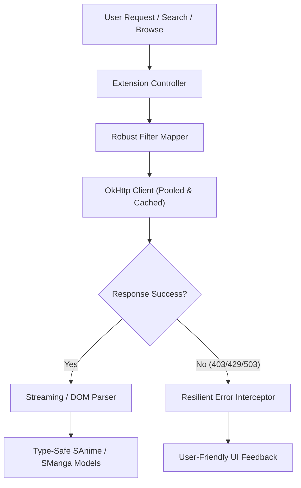

# Extension Upgrade Blueprint 🚀

This document outlines the architectural patterns and design systems to upgrade your extensions (Anime, Manga, and Novels) to be highly efficient, resilient, and developer-friendly.

---

## 🏗️ Architectural Overview



---

## ⚡ 1. High-Efficiency Design

To minimize CPU overhead, battery drainage, and memory footprints:

### A. Prefer Streaming JSON over HTML DOM Parsing
Many sources have hidden or undocumented REST APIs. Scraping HTML pages using JSoup is CPU-heavy and easily broken by website redesigns.
*   **Best Practice:** Always inspect network traffic to see if a mobile API or JSON endpoint is available.
*   **Technique:** Use `kotlinx.serialization` to deserialize only the required fields into data classes, bypassing large HTML document trees.
    ```kotlin
    @Serializable
    private data class SearchResultDto(
        val items: List<AnimeItem>
    ) {
        @Serializable
        data class AnimeItem(val id: String, val title: String, val cover: String)
    }
    ```

### B. Reuse OKHttp Clients & Enable Caching
Do not rebuild OkHttp clients per request. Use `.newBuilder()` to inherit connection pools.
*   **Cache Headers:** Implement proper `CacheControl` headers for static resources (e.g., genre lists, filter lists, detail mappings) to avoid unnecessary network Round Trip Times (RTT).

### C. Compile Regexes Lazily
Compiling `Regex` patterns inside looping functions is expensive.
*   **Best Practice:** Declare all Regexes inside the `companion object` or instantiate them lazily so they are compiled only once.
    ```kotlin
    companion object {
        private val ID_REGEX by lazy { Regex("""/drama/(\d+)""") }
    }
    ```

---

## 🔍 2. Robust Filtering System

Filters should be declarative, type-safe, and fail-safe.

### A. Clean Filter Mapping Pattern
Define filters using a clean, extensible class structure that translates directly into query parameters.
```kotlin
open class UriPartFilter(
    displayName: String,
    val vals: Array<String>,
    val keys: Array<String>
) : Filter.Select<String>(displayName, vals) {
    fun toQuery(): String = keys[state]
}
```

### B. Separate Filter Configs from the Main Class
Create a helper file (e.g., `LoklokFilters.kt` or `MangaDexFilters.kt`) to keep your main source files clean and readable.

---

## 🛡️ 3. Resilient Error Handling

Extensions must fail gracefully and tell the user exactly what went wrong.

### A. Catch & Translate HTTP Failures
Implement a unified interceptor or helper function to intercept response codes and throw custom, informative exceptions:

| HTTP Status | Root Cause | Custom Exception Message |
| :--- | :--- | :--- |
| **`403 Forbidden`** | Geo-blocking / IP ban | `"Geo-blocked (403): Please connect to a [Region] VPN."` |
| **`429 Too Many Requests`** | Rate limiting | `"Rate Limited: Too many requests. Please wait a moment."` |
| **`503 Service Unavailable`** | Cloudflare / DDoS wall | `"Cloudflare / DDoS protection active. Please solve in WebView."` |

### B. Defensive JSON Parsing
When parsing third-party JSON, never assume a key will always exist or remain a String. Use null-safe lookups (`jsonObject`, `jsonPrimitive.contentOrNull`) to avoid throwing generic NullPointerExceptions.

---

## 📝 4. Reference Extension Blueprint

Here is a blueprint skeleton for a modern, highly robust extension:

```kotlin
package eu.kanade.tachiyomi.animeextension.all.sample

import eu.kanade.tachiyomi.animesource.model.AnimeFilterList
import eu.kanade.tachiyomi.animesource.model.AnimesPage
import eu.kanade.tachiyomi.animesource.model.SAnime
import eu.kanade.tachiyomi.animesource.online.ParsedAnimeHttpSource
import eu.kanade.tachiyomi.network.GET
import okhttp3.OkHttpClient
import okhttp3.Response
import org.jsoup.nodes.Document
import org.jsoup.nodes.Element

class SafeSampleExtension : ParsedAnimeHttpSource() {
    override val name = "Safe Source"
    override val baseUrl = "https://api.safesource.com"
    override val lang = "all"
    override val supportsLatest = true

    // Reuse client connection pool
    override val client: OkHttpClient = network.client.newBuilder()
        .addInterceptor { chain ->
            val response = chain.proceed(chain.request())
            if (!response.isSuccessful) {
                val errorMsg = when (response.code) {
                    403 -> "Geo-blocked (403): Access denied by server."
                    429 -> "Rate Limited (429): Please slow down."
                    503 -> "DDoS Shield (503): Cloudflare block detected."
                    else -> "API error ${response.code}"
                }
                throw Exception(errorMsg)
            }
            response
        }
        .build()

    // 1. High-Efficiency JSON API Search
    override fun searchAnimeRequest(page: Int, query: String, filters: AnimeFilterList) =
        GET("$baseUrl/v1/search?q=$query&page=$page", headers)

    override fun searchAnimeParse(response: Response): AnimesPage {
        val body = response.body.string()
        if (body.isBlank()) return AnimesPage(emptyList(), false)

        return try {
            val jsonArray = json.parseToJsonElement(body).jsonArray
            val results = jsonArray.map { element ->
                val obj = element.jsonObject
                SAnime.create().apply {
                    url = obj["id"]?.jsonPrimitive?.content ?: ""
                    title = obj["title"]?.jsonPrimitive?.content ?: "Unknown"
                    thumbnail_url = obj["cover"]?.jsonPrimitive?.content
                }
            }
            AnimesPage(results, results.isNotEmpty())
        } catch (e: Exception) {
            throw Exception("Data format error: Failed to parse search results.")
        }
    }

    // 2. JSoup DOM Scraper (Fallback only)
    override fun animeDetailsParse(document: Document): SAnime = SAnime.create().apply {
        // Safe selection to prevent NPE crashes
        val detailsContainer = document.selectFirst(".details-container")
            ?: throw Exception("Details container not found. The site layout may have changed.")
            
        title = detailsContainer.selectFirst(".title")?.text() ?: "Unknown Title"
        description = detailsContainer.selectFirst(".summary")?.text() ?: ""
    }

    override fun latestUpdatesFromElement(element: Element): SAnime = throw UnsupportedOperationException()
    override fun latestUpdatesNextPageSelector(): String? = null
    override fun latestUpdatesRequest(page: Int) = throw UnsupportedOperationException()
    override fun latestUpdatesSelector(): String = throw UnsupportedOperationException()
    override fun popularAnimeFromElement(element: Element): SAnime = throw UnsupportedOperationException()
    override fun popularAnimeNextPageSelector(): String? = null
    override fun popularAnimeRequest(page: Int) = throw UnsupportedOperationException()
    override fun popularAnimeSelector(): String = throw UnsupportedOperationException()
    override fun searchAnimeFromElement(element: Element): SAnime = throw UnsupportedOperationException()
    override fun searchAnimeNextPageSelector(): String? = null
    override fun searchAnimeSelector(): String = throw UnsupportedOperationException()
    override fun episodeListSelector(): String = throw UnsupportedOperationException()
    override fun episodeFromElement(element: Element): SEpisode = throw UnsupportedOperationException()
    override fun videoListSelector(): String = throw UnsupportedOperationException()
    override fun videoFromElement(element: Element): Video = throw UnsupportedOperationException()
    override fun videoUrlParse(document: Document): String = throw UnsupportedOperationException()
}
```
